# RAG AI Tutor - Architecture Flowchart

```mermaid
flowchart TB
  %% ============================================================
  %% RAG AI Tutor Platform — User Journeys + System Flow
  %% ============================================================

  %% ------------------------
  %% Personas
  %% ------------------------
  subgraph P[Personas]
    L[Learner/Student]
    A[Admin]
  end

  %% ------------------------
  %% Primary UX Surfaces
  %% ------------------------
  subgraph UX[Frontend UX Surfaces]
    LOGIN[/Login Page/]
    SIGNUP[/Signup Page/]
    SUBJECTS[/Subjects Dashboard/]
    CHAT[/Chat Interface/]
    UPLOAD[/Document Upload/]
    QUIZ[/Quiz Modal/]
    SIDEBAR[/Sidebar Navigation/]
  end

  %% ------------------------
  %% Backend Components
  %% ------------------------
  subgraph BACKEND[Backend Services]
    AUTH[[Authentication Service<br/>JWT + MongoDB]]
    FILEPROC[[File Processing<br/>PDF/DOCX/PPTX/TXT Extraction]]
    PREPROC[[Preprocessing<br/>Chunking + Metadata]]
    VECTORDB[(Vector Store<br/>Simple Vector DB + Embeddings)]
    RAG[[RAG Pipeline<br/>Search + Context Building]]
    LLM[[LLM Interface<br/>Gemini API]]
    CHATAPI[[Chat API<br/>History + Response]]
    UPLOADAPI[[Upload API<br/>File Management]]
    QUIZAPI[[Quiz API<br/>Question Generation]]
  end

  %% ------------------------
  %% AI Engines
  %% ------------------------
  subgraph AI[AI Capabilities]
    SEARCH[[Hybrid Search<br/>BM25 + Semantic]]
    EMBED[[Embedding Service<br/>Sentence Transformers]]
    TUTOR[[Socratic Tutor<br/>Educational Prompting]]
    QUIZGEN[[Quiz Generator<br/>MCQ Creation]]
    MARKDOWN[[Markdown Renderer<br/>Citations + Formatting]]
  end

  %% ------------------------
  %% Data Layer
  %% ------------------------
  subgraph DATA[Data Storage]
    MONGODB[(MongoDB<br/>Users + Chats + Documents)]
    VECTORSTORE[(Vector Store JSON<br/>Embeddings + Chunks)]
    UPLOADS[(File System<br/>Uploaded Files)]
  end

  %% ------------------------
  %% Journey 1: User Authentication
  %% ------------------------
  subgraph J1[Journey: Authentication]
    L --> LOGIN
    L --> SIGNUP
    SIGNUP --> AUTH
    LOGIN --> AUTH
    AUTH --> MONGODB
    AUTH -->|JWT Token| SUBJECTS
  end

  %% ------------------------
  %% Journey 2: Document Upload & Indexing
  %% ------------------------
  subgraph J2[Journey: Document Upload & RAG Indexing]
    L --> SUBJECTS
    SUBJECTS --> SIDEBAR
    SIDEBAR -->|Upload Document| UPLOAD
    UPLOAD --> UPLOADAPI
    UPLOADAPI --> FILEPROC
    FILEPROC -->|Extract Text| PREPROC
    PREPROC -->|Create Chunks| EMBED
    EMBED -->|Generate Embeddings| VECTORDB
    VECTORDB --> VECTORSTORE
    UPLOADAPI --> MONGODB
    UPLOADAPI -->|Success Message| CHAT
  end

  %% ------------------------
  %% Journey 3: Chat with RAG (Daily Learning Loop)
  %% ------------------------
  subgraph J3[Journey: Chat with AI Tutor]
    L --> CHAT
    CHAT -->|User Question| CHATAPI
    CHATAPI -->|Retrieve History| MONGODB
    CHATAPI -->|Query| RAG
    RAG --> SEARCH
    SEARCH -->|BM25 + Vector Search| VECTORDB
    VECTORDB -->|Relevant Chunks| RAG
    RAG -->|Build Context + Prompt| TUTOR
    TUTOR --> LLM
    LLM -->|Generate Response| TUTOR
    TUTOR -->|Answer + Citations| CHATAPI
    CHATAPI -->|Save to History| MONGODB
    CHATAPI -->|Response| MARKDOWN
    MARKDOWN -->|Formatted HTML| CHAT
  end

  %% ------------------------
  %% Journey 4: Quiz Generation
  %% ------------------------
  subgraph J4[Journey: Quiz Generation from Documents]
    L --> SIDEBAR
    SIDEBAR -->|Generate Quiz| QUIZ
    QUIZ -->|Request| QUIZAPI
    QUIZAPI -->|Fetch Chunks| VECTORDB
    QUIZAPI -->|Generate MCQs| QUIZGEN
    QUIZGEN --> LLM
    LLM -->|Quiz Questions| QUIZAPI
    QUIZAPI -->|Questions| QUIZ
  end

  %% ------------------------
  %% Journey 5: Data Pre-Indexing (Admin)
  %% ------------------------
  subgraph J5[Journey: Bulk Data Indexing]
    A -->|Run Script| INDEXSCRIPT[[Index Data Folder Script]]
    INDEXSCRIPT --> FILEPROC
    FILEPROC -->|Process 54 Files| PREPROC
    PREPROC -->|4068 Chunks| EMBED
    EMBED -->|Global User Context| VECTORDB
    VECTORDB -->|Available to All Users| SEARCH
  end

  %% ------------------------
  %% Journey 6: Clear Documents
  %% ------------------------
  subgraph J6[Journey: Clear All Documents]
    L --> SIDEBAR
    SIDEBAR -->|Clear Documents| UPLOADAPI
    UPLOADAPI -->|Delete from DB| MONGODB
    UPLOADAPI -->|Clear Vectors| VECTORDB
    UPLOADAPI -->|Confirmation| CHAT
  end

  %% ------------------------
  %% Cross-links (UX ↔ Backend ↔ AI)
  %% ------------------------
  SUBJECTS -.-> SIDEBAR
  SIDEBAR -.-> CHAT
  SIDEBAR -.-> UPLOAD
  SIDEBAR -.-> QUIZ
  
  SEARCH -.-> EMBED
  RAG -.-> TUTOR
  TUTOR -.-> MARKDOWN
  
  %% ------------------------
  %% Styling
  %% ------------------------
  classDef ux fill:#f5f5f5,stroke:#333,stroke-width:2px;
  classDef backend fill:#e3f2fd,stroke:#1976d2,stroke-width:2px;
  classDef ai fill:#fff3e0,stroke:#f57c00,stroke-width:2px;
  classDef data fill:#e8f5e9,stroke:#388e3c,stroke-width:2px;
  classDef persona fill:#fce4ec,stroke:#c2185b,stroke-width:2px;

  class LOGIN,SIGNUP,SUBJECTS,CHAT,UPLOAD,QUIZ,SIDEBAR ux;
  class AUTH,FILEPROC,PREPROC,VECTORDB,RAG,LLM,CHATAPI,UPLOADAPI,QUIZAPI backend;
  class SEARCH,EMBED,TUTOR,QUIZGEN,MARKDOWN ai;
  class MONGODB,VECTORSTORE,UPLOADS data;
  class L,A persona;
```

## Key Components

### Personas
- **Learner/Student**: Primary user who uploads documents, chats with AI, takes quizzes
- **Admin**: System administrator who can pre-index bulk documents

### Frontend UX Surfaces
- **Login/Signup**: Authentication pages
- **Subjects Dashboard**: Main workspace with chat and sidebar
- **Chat Interface**: Markdown-rendered AI responses with interactive citations
- **Document Upload**: Drag-and-drop file upload
- **Quiz Modal**: AI-generated multiple-choice questions
- **Sidebar Navigation**: New chat, upload, quiz, clear documents

### Backend Services
- **Authentication**: JWT-based auth with MongoDB
- **File Processing**: Extracts text from PDF, DOCX, PPTX, TXT
- **Preprocessing**: Chunks documents with overlap and metadata
- **Vector Store**: Embeddings + semantic search
- **RAG Pipeline**: Hybrid search (BM25 + semantic) + context building
- **LLM Interface**: Gemini API integration with Socratic prompting

### AI Capabilities
- **Hybrid Search**: Combines keyword (BM25) and semantic search
- **Embedding Service**: Sentence Transformers (all-MiniLM-L6-v2)
- **Socratic Tutor**: Educational AI that asks guiding questions
- **Quiz Generator**: Creates MCQs from document content
- **Markdown Renderer**: Formats responses with interactive citations

### Data Storage
- **MongoDB**: Users, chat history, documents metadata
- **Vector Store**: JSON-based vector database with embeddings
- **File System**: Uploaded document files

## User Journeys

1. **Authentication**: Sign up → Login → Get JWT → Access dashboard
2. **Document Upload**: Upload file → Extract text → Chunk → Embed → Store in vector DB
3. **Chat with RAG**: Ask question → Search vectors → Build context → LLM generates answer → Render with citations
4. **Quiz Generation**: Request quiz → Fetch chunks → Generate MCQs via LLM → Display
5. **Bulk Indexing**: Admin script processes data folder → 54 files → 4068 chunks → Available to all
6. **Clear Documents**: Delete all → Remove from DB + vectors → Confirm

## Technology Stack

- **Frontend**: HTML, CSS, JavaScript, Marked.js
- **Backend**: Python, FastAPI, Uvicorn
- **Database**: MongoDB
- **Vector Store**: Custom simple vector DB with sentence-transformers
- **LLM**: Google Gemini API (gemini-2.5-flash)
- **File Processing**: pypdf, python-docx, python-pptx, Pillow
