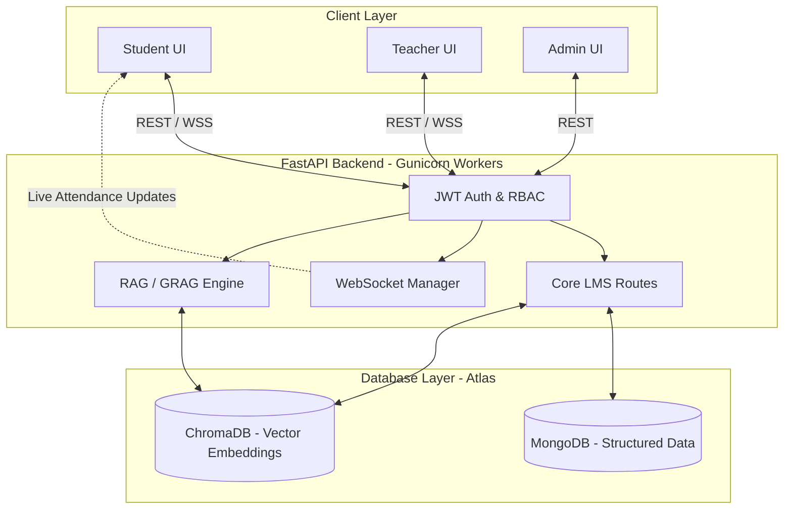
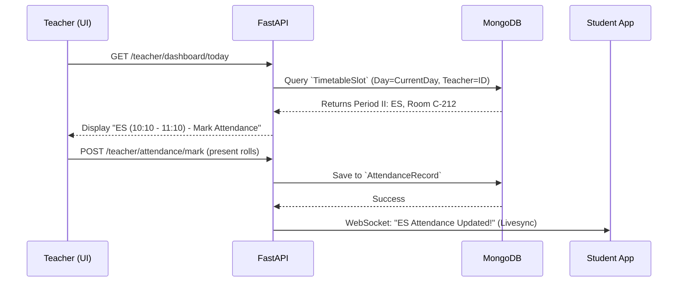
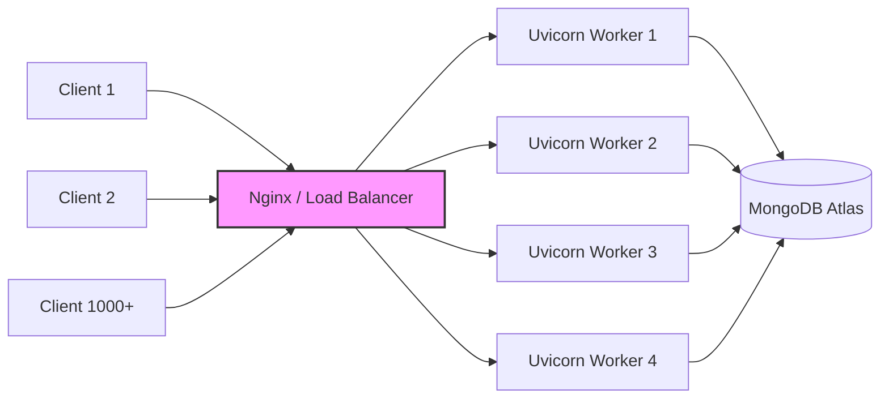

# 🎓 Academic Real-Time System Design

Based on the requirements and the CBT BE-VIII Semester (CSE-1) timetable, here is the complete technical blueprint to upgrade your RAG-AI-Tutor into a scalable, real-time college LMS.

This document contains everything you need for implementation and your project presentation (PPT).

---

## 🗄️ 1. MongoDB Schema (FastAPI Pydantic Models)

These are the exact Pydantic models you should add to your `backend/models/` directory. They represent the MongoDB schema design.

```python
from pydantic import BaseModel, Field
from typing import List, Optional
from datetime import datetime, date

# 🏫 1. Semester Schema
class Semester(BaseModel):
    id: Optional[str] = Field(None, alias="_id")
    name: str               # e.g., "BE - VIII Semester (CSE-1)"
    start_date: date        # e.g., "2026-01-19"
    end_date: date
    is_active: bool = True

# 📚 2. Subject & Faculty Schema
class Subject(BaseModel):
    id: Optional[str] = Field(None, alias="_id")
    name: str               # e.g., "Environmental Science"
    short_code: str         # e.g., "ES"
    semester_id: str
    teacher_id: str         # Links to User schema role="teacher"
    is_practical: bool = False # True for Project Part-II

# 📅 3. Timetable Schema (Stores fixed weekly slots)
class TimetableSlot(BaseModel):
    id: Optional[str] = Field(None, alias="_id")
    semester_id: str
    day_of_week: str        # e.g., "Wednesday", "Thursday"
    period_number: int      # 1 to 6
    start_time: str         # e.g., "09:10"
    end_time: str           # e.g., "10:10"
    subject_id: str
    teacher_id: str
    room: str               # e.g., "C-212"

# ✅ 4. Attendance Schema (Real-time tracking)
class AttendanceRecord(BaseModel):
    id: Optional[str] = Field(None, alias="_id")
    timetable_slot_id: str
    date: date              # Exact date of the class
    subject_id: str
    teacher_id: str
    present_roll_numbers: List[str] # Validates against 160122733xxx
    absent_roll_numbers: List[str]

# 📝 5. Academic Profile (Added to existing Student User model)
class StudentProfile(BaseModel):
    roll_number: str        # e.g., "160122733001"
    semester_id: str
    enrolled_subjects: List[str]
    fee_status: str         # "Paid", "Pending"
```

---

## ⚡ 2. API Endpoints (FastAPI)

Add these routes to connect the frontend to your new academic database.

```python
from fastapi import APIRouter, UploadFile, File, Depends, HTTPException
import pandas as pd # For Excel parsing

router = APIRouter(prefix="/api/v1")

# ==========================================
# 👑 ADMIN ENDPOINTS
# ==========================================

@router.post("/admin/students/bulk-enroll")
async def bulk_enroll_students(file: UploadFile = File(...)):
    """Upload Excel/CSV of roll numbers to auto-create student accounts."""
    df = pd.read_excel(file.file)
    # Logic to create users and assign to semester
    return {"message": f"Successfully enrolled {len(df)} students."}

@router.post("/admin/timetable/upload")
async def upload_college_timetable(file: UploadFile = File(...)):
    """Upload timetable Excel sheet. Auto-parses layout into TimetableSlot DB."""
    # Logic to map timeslots to DB (Period I -> 9:10-10:10)
    return {"message": "Timetable successfully mapped to C-212."}

# ==========================================
# 👨‍🏫 TEACHER ENDPOINTS
# ==========================================

@router.get("/teacher/dashboard/today")
async def teacher_today_schedule(current_teacher = Depends(get_current_user)):
    """Gets teacher's classes for today based on TimetableSlot & Day."""
    # Eg: Return [Period 1 OE-III, Period 5 OE-III] for Friday
    pass

@router.post("/teacher/attendance/mark")
async def mark_slot_attendance(
    slot_id: str, 
    date: str, 
    presents: List[str]
):
    """Marks attendance. Websocket can emit live update to students."""
    # Save to AttendanceRecord DB
    pass

@router.get("/teacher/reports/export-excel")
async def export_marks_excel(subject_id: str):
    """Generates an Excel sheet with all students and marks, streams back to UI."""
    # Use pandas to generate marks.xlsx
    pass

# ==========================================
# 🎓 STUDENT ENDPOINTS
# ==========================================

@router.get("/student/timetable/today")
async def student_today_schedule(current_student = Depends(get_current_user)):
    """Returns today's classes + Room number (C-212) + upcoming class."""
    pass

@router.get("/student/attendance/summary")
async def get_attendance_percentage(current_student = Depends(get_current_user)):
    """Calculates attendance % per subject for the student roll number."""
    pass
```

---

## 🖥️ 3. Frontend UI Structure

How the frontend should be structured to consume these APIs.

### 🎓 Student Dashboard (`/student-dashboard`)
*   **Top Bar:** Roll Number, Name, Notifications (e.g., "Next Class: ES in 10 mins").
*   **Widget 1: Live Timetable (Today):** Highlights the *current* period dynamically based on system time.
*   **Widget 2: Attendance Circle Chart:** Overall % and breakdown per subject (ES, OE-III).
*   **Widget 3: AI Tutor Integration:** "You have a free slot in Period 4. Want to revise OE-III?"
*   **Widget 4: Pending Tasks:** Upcoming assignments for Project Part-II.

### 👨‍🏫 Teacher Dashboard (`/teacher-dashboard`)
*   **Widget 1: Today's Classes:** Quick cards showing time, room (C-212), and a big "Mark Attendance" button.
*   **Widget 2: Quick Actions:** Create Assignment, Upload Notes, Start Online Quiz.
*   **Widget 3: Subject Performance:** Average marks of the class. Download Excel button.

### 👑 Admin Control Panel (`/admin-panel`)
*   **Data Import Module:** Drag-and-drop zones for `students.xlsx`, `teachers.xlsx`, and `timetable.csv`.
*   **System Health:** Live concurrent users, server load.

---

## 📊 4. Flowcharts for PPT

Use these Mermaid diagrams directly in your presentation or documentation.

### A. Real-Time System Architecture



### B. Automated Attendance Flow (Mapping Timetable)



### C. Backend Scaling Strategy (For Explanation in Viva)


